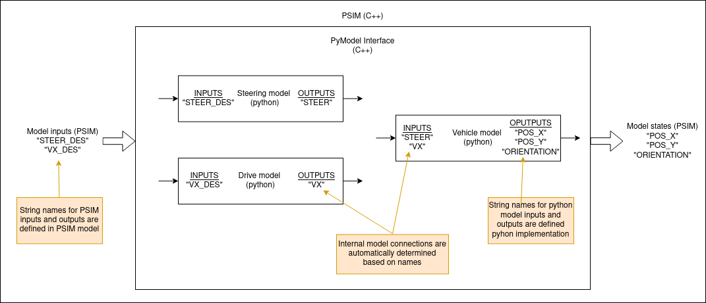

# Learned Model

This is the design document for the Python learned model used in the `simple_planning_simulator` package.

## Purpose / Use cases

<!-- Required -->
<!-- Things to consider:
    - Why did we implement this feature? -->

This library creates an interface between models in Python and PSIM (C++). It is used to quickly deploy learned Python models in PSIM without a need for complex C++ implementation.

## Design

<!-- Required -->
<!-- Things to consider:
    - How does it work? -->

Using this Python model interface a PSIM model consisting of sub-models implemented in Python can be created. Each sub-model has string names for all of its inputs/outputs which are used to automatically create model interconnections (see image below).  



## Assumptions / Known limits

<!-- Required -->

To use this package `python3` and `pybind11` need to be installed. The only assumption on Python sub-models is their interface (see below).

```python
class CustomPythonSubmodel:

    def forward(self, action, state):  # Required
        """
        Calculate forward pass through the model and returns next_state.
        """
        return list()
    
    def get_state_names(self):  # Required
        """
        Return list of string names of the model states (outputs).
        """
        return list()

    def get_action_names(self):  # Required
        """
        Return list of string names of the model actions (inputs).
        """
        return list()

    def reset(self):  # Required
        """
        Reset model. This function is called after load_params().
        """
        pass

    def load_params(self, path):  # Optional
        """
        Load parameters of the model. 
        Inputs:
            - path: Path to a parameter file to load by the model.
        """
        pass
```

## API

<!-- Required -->
<!-- Things to consider:
    - How do you use the package / API? -->

### Parameter description


## References / External links

<!-- Optional -->

## Related issues

<!-- Required -->
